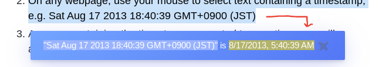

#  Timezone Converter

This extension allows easy conversion of freeform text timestamps to a user-configured timezone

## Usage

1. Set your timezone in the extension popup
1. Use your mouse to select text containing a timestamp, e.g. Sat Aug 17 2013 18:40:39 GMT+0900 (JST)
1. A popup containing the timestamp converted to your timezone will appear:

## Features

- Parses freeform timestamps
- User configured timezone
- Popup configuration

## Install

[**Chrome** extension]() <!-- TODO: Add chrome extension link inside parenthesis -->

## Contribution

Suggestions and pull requests are welcomed!

---

This project was bootstrapped with [Chrome Extension CLI](https://github.com/dutiyesh/chrome-extension-cli)\
Timestamp parsing using [chrono](https://github.com/wanasit/chrono)\
Popups using [toastify-js](https://github.com/apvarun/toastify-js)